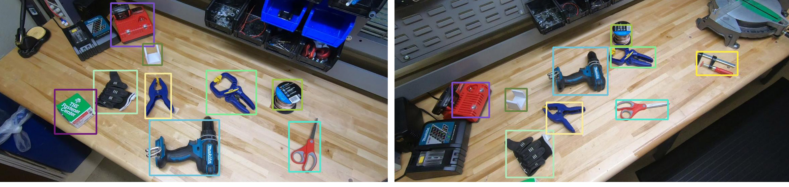

## Abstract

We propose a self-supervised approach for learning representations of objects from monocular videos and
demonstrate it is particularly useful in situated settings such as robotics.
The main contributions of this paper are:
1) a self-supervising objective trained with contrastive learning that can discover and disentangle object attributes from video without using any labels;
2) we leverage object self-supervision for online adaptation: the longer our online model looks at objects in a video, the lower the object identification error, while the offline baseline remains with a large fixed error;
3) to explore the possibilities of a system entirely free of human supervision, we let a robot collect its own data, train on this data with our self-supervise scheme, and then show the robot can point to objects similar to the one presented in front of it, demonstrating generalization of object attributes.

An interesting and perhaps surprising finding of this approach is that given a limited set of objects, object correspondences will naturally emerge when using contrastive learning without requiring explicit positive pairs.
Videos illustrating online object adaptation and robotic pointing are available as supplementary material.

[here]: https://learning-from-play.github.io

<!-- 

<video class="b-lazy" data-src="assets/mp4/lmp_8tasks960x400.mp4" type="video/mp4" autoplay muted playsinline loop style="display: block; width: 100%;"></video>
<figcaption>
Figure 1: a single Play-LMP policy (right) performing 8 tasks in a row by being conditioned on 8 different goals provided by the user (right).
</figcaption>

 -->

______

<!-- 

<figcaption>
Figure 2. Play-LMP: A single model that self-supervises control from play data, then generalizes to a wide variety of manipulation tasks. Play-LMP 1) samples random windows of experience from a memory of play data. 2) learns to recognize and organize a repertoire of behaviors executed during play in a latent plan space, 3) trains a policy, conditioned on current state, goal state, and a sampled latent plan to reconstruct the actions in the selected window.
Latent plan space is shaped by two stochastic encoders: plan recognition and plan proposal. Plan recognition takes the entire sequence, recognizing the exact behavior executed. Plan proposal takes the initial and final state, outputting a distribution over all possible behaviors that connect initial state to final. We minimize the KL divergence between the two encoders, making plan proposal assign high likelihood to behaviors that were actually executed during play.
</figcaption>

 -->

## Introduction

<!-- \begin{figure}[h]
  \begin{center}
  \includegraphics[width=1.0\linewidth]{images/teaser_views_v3.jpg}\\[2mm]
  \includegraphics[width=1.0\linewidth]{images/teaser_chart_v2.pdf}
  \end{center}
    \vspace{-6mm}
  \caption{\textbf{The longer our model looks at objects in a video, the lower the object identification error.} Top: example frames of a work bench video along with the detected objects. Bottom:~result of online training on the same video. Our model self-supervises object representations as the video progresses and converges to 2\% error while the offline baseline remains at 52\% error.}
  \label{fig:online}  
  \vspace{-5mm}
\end{figure} -->

<!-- <video class="b-lazy" data-src="assets/mp4/lmp_8tasks960x400.mp4" type="video/mp4" autoplay muted playsinline loop style="display: block; width: 100%;"></video> -->
<figcaption>
Figure 1: the longer our model looks at objects in a video, the lower the object identification error.} Top: example frames of a work bench video along with the detected objects. Bottom: result of online training on the same video. Our model self-supervises object representations as the video progresses and converges to 2% error while the offline baseline remains at 52% error.
</figcaption>

One of the biggest challenges in real world robotics is robustness and adaptability to new situations. A robot deployed in the real world is likely to encounter a number of objects it has never seen before. Even if it can identify the class of an object, it may be useful to recognize a particular instance of it.
Relying on human supervision in this context is unrealistic.
Instead if a robot can self-supervise its understanding of objects, it can adapt to new situations when using online learning.
Online self-supervision is key to robustness and adaptability and arguably a prerequisite to real-world deployment. Moreover, removing human supervision has the potential to enable learning richer and less biased continuous representations than those obtained by supervised training and a limited set of discrete labels. Unbiased representations can prove useful in unknown future environments different from the ones seen during supervision, a typical challenge for robotics. Furthermore, the ability to autonomously train to recognize and differentiate previously unseen objects as well as to infer general properties and attributes is an important skill for robotic agents.

In this work we focus on situated settings (i.e. an agent is embedded in an environment), which allows us 
to use temporal continuity as the basis for self-supervising correspondences between different views of objects. We present a self-supervised method that learns representations to disentangle perceptual and semantic object attributes such as class, function, and color. We automatically acquire training data by capturing videos with a real robot; a robot base moves around a table to capture objects in various arrangements. Assuming a pre-existing objectness detector, we extract objects from random frames of a scene containing the same objects, and let a metric learning system decide how to assign positive and negative pairs of embeddings. Representations that generalize across objects naturally emerge despite not being given groundtruth matches. Unlike previous methods, we abstain from employing additional self-supervisory training signals such as depth or those used for tracking. The only input to the system are monocular videos. This simplifies data collection and allows our embedding to integrate into existing end-to-end learning pipelines. We demonstrate that a trained Object-Contrastive Network~(OCN) embedding allows us to reliably identify object instances based on their visual features such as color and shape. Moreover, we show that objects are also organized along their semantic or functional properties. For example, a cup might not only be associated with other cups, but also with other containers like bowls or vases. 

Figure 1 shows the effectiveness of online self-supervision: by training on randomly selected frames of a continuous video sequence (top) OCN can adapt to the present objects and thereby lower the object identification error. While the supervised baseline remains at a constant high error rate (52.4%), OCN converges to a 2.2\% error. The graph (bottom) shows the object identification error obtained by training on  progressively longer sub-sequences of a 200 seconds video. 

The key contributions of this work are: 
1) a self-supervising objective trained with contrastive learning that can discover and disentangle object attributes from video without using any labels;
2) we leverage object self-supervision for online adaptation: the longer our online model looks at objects in a video, the lower the object identification error, while the offline baseline remains with a large fixed error;
3) to explore the possibilities of a system entirely free of human supervision: we let a robot collect its own data, then train on this data with our self-supervised training scheme, and show the robot can point to objects similar to the one presented in front of it, demonstrating generalization of object attributes.

## Method

<!-- **Play data**&nbsp;&nbsp;

Consider play data, an unbounded sequence of states and actions corresponding to voluntary, repeated, non-stereotyped object interaction between an agent and it's environment.

$\mathcal{D} = \{(s_1, a_1), (s_2, a_2), \cdots, (s_T, a_T)\}$

In our experiments, we define play data as the states and actions logged during human play teleoperation of a robot in a playground environment. Find an example of such data in Figure 3.

<figcaption>
Figure 5: 
Task-agnostic policy inference.
The policy is conditioned on a latent plan which is sampled once from a plan distribution (inferred from the current and goal states).
The policy is also conditioned on the current state as well as the goal state desired by the user.
</figcaption>

**Play-LMP**&nbsp;&nbsp;
As described earlier, play is characterized as repeated object interaction that cannot be rigidly stereotyped. In this way, play can be expected to contain multiple ways of achieving the same outcome. An operator playing in an environment with a door isn't looking for the most efficient way to open it repeatedly. They will rather, through the course of curiosity or boredom, naturally experiment with the many ways the door can be opened--fast, slow, by grasping the top of the handle, the bottom of the handle etc. Intuitively, there are many distinct behaviors that might take an agent from a particular initial state to a particular final state.
The presence of multiple action trajectories for the same (current state, goal state) pair presents a challenge to models seeking to learn goal-conditioned control in the form of counteracting action labels.
This can be considered a multimodal representation learning problem: policies must be powerful enough to model all possible high-level behaviors that lead to the same goal outcome.

With this motivation in mind, we introduce Play-LMP (play-supervised latent motor plans), a hierarchical latent variable model for learning goal-conditioned control.
Play-LMP simultaneously learns 1) *reusable latent plan representations* from play data and 2) *plan and goal-conditioned policies*, capable of decoding learned latent plans into actions to reach user-specified goal states.
We call the representation space learned by Play-LMP "latent plan space". The intent is that individual points in the space correspond to behaviors recognized during play that got the agent from some initial state to some final state. We call points in the space "latent plans" because a single point should carry the necessary information for how to act, should it find itself at some point in the future in a similar initial state, trying to reach a similar goal state. That is, the embedding space is designed for efficient reuse.

Local regions of plan space should correspond to distinct solutions to the same task. In this way, we aim for Play-LMP to explicitly model the "multiple solutions'' problem in play data, relieving the policy of that effort. That is, a policy conditioned on current state, goal state, and *latent plan* only needs to learn how to follow the specific plan. Ideally, latent plans provide *disambiguating* information to the policy, turning a multimodal representation learning problem into a unimodal one. Hence, we aim for Play-LMP to recognize a repertoire of reusable behaviors simply by passively recalling play experience, then invoke them at test time to solve user-specified tasks.
Finally we note that although Play-LMP was designed to ameliorate multimodality issues in play data, it is a general self-supervised control learning method that could in principle operate on any collection of state-action sequences.

Concretely, our training method consists of three modules:
* *Plan Recognizer* $\Phi$: A stochastic sequence encoder that takes a randomly sampled play sequence $\tau$ as input, mapping it to a distribution in latent plan space $q_{\Phi}(z|\tau)$. The motivation of this encoder is to act as "recognition" network, identifying which region of latent plan space the behavior executed during the play sequence belongs to. $\Phi$ is used only at training time to extract latent plan representations from the unlabeled data. This can be interpreted as a learned variational posterior over latent plan states.
* *Plan Proposer* $\Psi$: A stochastic encoder taking the initial state $s_i$ and final state $s_g$ from the same sampled sequence $\tau$, outputting distribution $p_{\Psi}(z|s_i, s_g)$. The goal of this encoder is to represent the full distribution over behaviors that connect the current state to the goal state, potentially capturing multiple distinct solutions. This can be interpreted as a learned conditional prior.
* *Goal and plan conditioned policy* $\pi$: A policy conditioned on the current state $s_t$, goal state $s_g$, and a latent plan $z$ sampled from $\Phi$, trained to reconstruct the actions the agent took during play to reach the goal state from the initial state, as described by inferred plan $z$.

We now describe each of the modules in detail and the losses used to train them. For a visual description of the training procedure, see Figure 2.

**Plan Recognizer**&nbsp;&nbsp;
Consider a sequence of state action pairs $\tau$ of window length $\kappa$ sampled at random from the play dataset $\mathcal{D}$:

$\tau = \{(s_{k:k+\kappa}, a_{k:k+\kappa})\} \thicksim \mathcal{D}$

We define a stochastic sequence encoder, $\Phi$, referred to throughout the paper as the "plan recognizer", which takes as input $\tau$ and outputs a distribution over latent plans. Intuitively, the idea is for the encoder not to learn to recognize plan codes as single points, but as
ellipsoidal regions in latent space, forcing the codes
to fill the space rather than memorizing individual training data. We parameterize our sequence encoder $\Phi$ with a bidirectional recurrent neural network with parameters $\theta_\Phi$, which produces means and variances in latent plan space from $\tau$.

$\mu_\Phi, \sigma_\Phi = \Phi(\tau, \theta_\Phi)$

As is typical with training VAEs, we assume the encoder has a diagonal covariance matrix, i.e. $z \sim N(\mu_\Phi, diag(\sigma_\Phi^2))$.
Individual latent plans $z$ are sampled from this distribution at training time via the "reparameterization trick" (<dt-cite key="kingma2013auto"></dt-cite>) and handed to a latent plan and goal conditioned action decoder (described in the next section) to be decoded into reconstructed actions. The sequence encoder is then trained with action reconstruction loss $\mathcal{L}_{\pi}$ and the self-supervised
While we could in principle use the sequence encoder at test time to perform full sequence imitation, in this work we restrict our attention to tasks specified by individual user-provided goal states. Therefore, the sequence encoder is only used at training time to help learn a latent plan space, and is discarded at test time.

**Plan Proposer**&nbsp;&nbsp;
We also define a plan proposal network, $\Psi$, which maps initial state $s_i$ and goal state $s_g$ to a distribution over latent plans. The goal of this network is to output the full distribution of possible plans or behaviors that an agent could execute to get from a particular initial state to a particular goal state. We parameterize the plan encoder $\Psi$ with a multi-layer neural network with parameters $\theta_\Psi$, which produces means $\mu_\Psi$ and variances $\sigma_\Psi$ in latent plan space from the $s_i$ to $s_g$. For simplicity, we choose a unimodal multivariate Gaussian to represent distributions in latent plan space; nothing in principle stops us from using more complicated distributions. 

$\mu_\Psi, \sigma_\Psi = \Psi(s_i, s_g; \theta_\Psi)$

Similarly we assume the plan encoder has a diagonal covariance matrix, i.e. $z \thicksim \mathcal{N}(\mu_\Psi, diag(\sigma_\Psi^2))$. Note that $\Psi$ is a stochastic encoder, which outputs a distribution in the same latent plan space as $\Phi$. Both $\Phi$ and $\Psi$ are trained jointly by minimizing the KL divergence between the two distributions:

$\mathcal{L}_{KL} = KL\Big(\mathcal{N}(z|\mu_\Phi, diag(\sigma_\Phi^2)) ~||~ \mathcal{N}(z|\mu_\Psi,diag(\sigma_\Psi^2)) \Big)$

Intuitively, $\mathcal{L}_{KL}$ forces the plan distribution output by the planner $\Psi$ to place high probability on actual latent plans recognized during play. Simultaneously it enforces a regular geometry over codes output by the plan recognizer $\Phi$, allowing plausible plans to be sampled at test time from regions of latent space that have high probability under the conditional prior $\Psi$.

**Task agnostic, goal and latent plan conditioned policy**&nbsp;&nbsp;
Here we describe how we train our task-agnostic policy to achieve user-specified goals. Our policy $\pi$, parameterized by $\theta_\pi$, is an RNN that takes as input current state $s_t$, goal state $s_g$, and a sampled latent plan $z$, and outputs action $a_t$.
The policy is trained via maximum likelihood to reconstruct the actions taken during the sequence sampled from play.
To obtain action predictions at training time, we sample $z$ once from the distribution output by $\Phi$ (which has been conditioned on the entire state-action sequence $\tau$), then for each timestep $t$ in the sequence, we compute actions $a_t$ from inputs $s_t$, $s_g$, and $z$. The loss term $\mathcal{L}_{\pi}$ corresponding to the action prediction is determined as follows:

$\mathcal{L}_\pi = -\frac{1}{\kappa} \sum_{t=k}^{k+\kappa} log\big(\pi(a_t | s_t, s_g, z)\big)$

Note that we can optionally also have the decoder output state predictions, and adds another loss term penalizing a state reconstruction loss.

As mentioned earlier, at test time $\Phi$ is discarded and we sample $z$ from the distribution output by plan proposal network $\Psi$, conditioned on $s_t$, $s_g$ as described in Section "Plan Proposal".
The motivation for this architecture is to relieve the policy from having to representing multiple valid action trajectory solutions implicitly. Since $\Phi$ processes the full state-action sequence $\tau$ to be reconstructed, a plan sampled from $\Phi$ should provide *disambiguating information* to the policy at training time, converting a multimodal problem (learn every plan) to a unimodal one (learn to decode this specific plan).

**Full objective**&nbsp;&nbsp;
Following <dt-cite key="higgins2016beta">Higgins et al.</dt-cite>, we introduce a weight $\beta$, controlling $\mathcal{L}_{KL}$'s contribution to the total loss. Setting $\beta$ $<$ 1 was sufficient to avoid "posterior collapse" (<dt-cite key="DBLP:journals/corr/BowmanVVDJB15">Bowman et al.</dt-cite>), a commonly identified problem in VAE training in which an over-regularized model combined with a powerful decoder tends to ignores the latent variable $z$. The full Play-LMP training objective is:

$\mathcal{L}_{LMP} = \frac{1}{\kappa} \mathcal{L}_\pi + \beta \mathcal{L}_{KL}$

We describe the full Play-LMP minibatch training pseudocode in Algorithm 1.

**A connection to conditional variational autoencoder**&nbsp;&nbsp;
Play-LMP can be interpreted as a conditional variational sequence to sequence autoencoder <dt-cite key="NIPS2015_5775"></dt-cite>, autoencoding random experiences extracted from play memory through a latent plan space. In the framework of variational inference, we can view the plan recognizer $\Phi$ as a *learned posterior recognition model* $q_\Phi(z|\tau)$. Additionally, we can view the plan proposal network $\Psi$ as a *learned conditional prior* $p_\Psi(z|s_t,s_g)$. The full objective is similar to <dt-cite key="higgins2016beta">Higgins et al.</dt-cite>.

**Zero-shot control at test time**&nbsp;&nbsp;
At test time, we use the trained plan proposer $\Psi$, and plan and goal-conditioned policy $\pi$ to achieve *user-specified* manipulation goals.

The inputs at test time are the conventional inputs to a goal-conditioned control problem, the current environment state $s_i$ and goal state $s_g$.
For example $s_i$ could be the end effector resting over the table, and $s_g$ could be the end effector pressing the green button. Together, ($s_i$, $s_g$) specify a test time manipulation task.

Our trained agent achieves goal-conditioned control as follows: 1) feed $s_i$ and $s_g$ into its trained plan proposal network $\Psi$, which outputs a distribution over all learned latent plans that might connect $s_i$ to $s_g$. 2) sample a single latent plan $z$,
3) hand ($s_i$, $s_g$, $z$) to plan and goal-conditioned policy $\pi$, outputting a distribution over low-level actions. 4) Sample an action, $a_t$, move to the next state $s_t$, then repeat 3). 

Note that during test time rollouts, we keep the $z$ input to the policy fixed over $\kappa$ steps (matching the planning horizon it was trained with). That is, it is free to replan using the current state $s_i$ and fixed goal state $s_g$ every $\kappa$ steps. In our experiments, our agent gets observations and takes low-level actions at 30hz. We set $\kappa$ to 32, meaning that the agent replans at roughly $1$hz. See Figure 5 for details.

**Play-GCBC**&nbsp;&nbsp;
We also train a play-supervised goal conditioned policy in a similar fashion to Play-LMP, but with no explicit latent plan inference. We denote this policy by $\pi_{GCBC}$ and parameterized it by $\theta_{GCBC}$.That is, we train an RNN to maximize the likelihood of an action sequence sampled from play data, given the corresponding state sequence. The policy is conditioned on current state $s_t$ and goal state $s_g$ as before. We call this \gcbc (play-supervised goal-conditioned behavioral cloning), and describe the minibatch training pseudo-code in Algorithm 2.

 -->

## Experiments

## Discussion

## Related Work

<!-- Robotic learning methods generally require some form of supervision to acquire behavioral skills--conventionally, this supervision either consists of a cost or reward signal, as in reinforcement learning <dt-cite key="sutton2018reinforcement,kober2013reinforcement,deisenroth2013survey"></dt-cite>, or demonstrations, as in imitation learning <dt-cite key="pastor2009learning,argall2009survey"></dt-cite>. However, both of these sources of supervision require considerable human effort to obtain: reward functions must be engineered by hand, which can be highly non-trivial in environments with natural observations, and demonstrations must be provided manually for each task. When using high-capacity models, hundreds or even thousands of demonstrations may be required for each task (<dt-cite key="DBLP:journals/corr/abs-1710-04615,DBLP:journals/corr/RahmatizadehABL17,rajeswaran2017learning,DBLP:journals/corr/DuanASHSSAZ17"></dt-cite>.
In this paper, we instead aim to learn general-purpose policies that can flexibly accomplish a wide range of user-specified tasks, using data that is not task-specific and is easy to collect. Our model can in principle use *any past experience for training, but the particular data collection approach we used is based on human-provided play data.

In order to distill non-task-specific experience into a general-purpose policy, we set up our model to be conditioned on the user-specified goal. Goal conditioned policies have been explored extensively in the literature for reinforcement learning <dt-cite key="kaelbling1993learning,pong2018temporal,nair2018visual,schaul2015universal,andrychowicz2017hindsight,DBLP:journals/corr/abs-1712-00948,DBLP:journals/corr/abs-1711-06006,DBLP:journals/corr/CabiCHDWF17,DBLP:journals/corr/SukhbaatarKSF17"></dt-cite>,
as well as for control via inverse models <dt-cite key="DBLP:journals/corr/AgrawalNAML16,DBLP:journals/corr/NairCAIAML17,christiano2016transfer,DBLP:journals/corr/abs-1805-01954"></dt-cite>.
Learning powerful goal-conditioned policies with reinforcement learning can produce policies with good long-horizon performance, but is difficult in terms of both the number of samples required and the need for extensive on-policy exploration <dt-cite key="pinto2017asymmetric,pinto2015supersizing,levine2017grasping,ebert2017videoprediction,finn2016visualforesight,lange2012autonomous,lillicrap2015continuous, levine2016gps"></dt-cite>.
We instead opt to train our model with supervised learning. This introduces a major challenge, since the distribution over actions that can reach a temporally distant goal from the current state based on the data can be highly multimodal. Even single-task imitation models of this sort must contend with multi-modality <dt-cite key="rahmatizadeh2018vision"></dt-cite>, and goal-conditioned models are typically restricted to short and relatively simple tasks, such as pushing <dt-cite key="DBLP:journals/corr/AgrawalNAML16"></dt-cite>, repositioning rope <dt-cite key="DBLP:journals/corr/NairCAIAML17"></dt-cite>, or short-distance navigation <dt-cite key="DBLP:journals/corr/pathakICLR18zeroshot"></dt-cite>. We tackle substantially more temporally extended tasks, using our proposed latent plan model, which models the multimodality explicitly using a hierarchical latent variable model.

Our work on learning latent plans is most related to <dt-cite key="hausman2018learning"></dt-cite>, who present a method for reinforcement learning of closely related manipulation skills, parameterized via an explicit skill embedding space. They assume a fixed set of initial tasks at training time, with access to accompanying per task reward functions to drive policy and embedding learning.
In contrast, our method relies on unsegmented, unlabeled play data with no predefined task training distribution.
It additionally requires no reward function, and performs policy training via supervised learning, yielding orders of magnitude greater sample efficiency. Finally, they generalize to new skills by freezing the learned policy and learning a new mapping to the embedding space, whereas Play-LMP generalizes to new tasks simply by feeding a new current and goal state pair to the trained plan proposal network.

Our self-supervised learning method for learning latent plans relates to other works in self-supervised representation learning from sequences 
<dt-cite key="wang2015unsupervised,misra2016shuffle,Sermanet2017TCN"></dt-cite>.
It decouples high and low level planning to achieve better task generalization, a strategy well studied in the literature. For example in <dt-cite key="Sermanet2009Multirange"></dt-cite>, they run a simple low-level planner at high-frequency while running a more sophisticated higher-level planner at low-frequency. This resulted in a more responsive low-level controller, resulting in fewer collisions, in an off-road navigation task, while the long-term planner could plan better routes. Additionally, the lower-frequency long-term planning meant that paths were more stable and oscillations were reduced.

Lastly, our work is related to prior research on few-shot learning of skills from demonstrations <dt-cite key="finn2017one,wang2017robust,DBLP:journals/corr/JamesDJ17,DBLP:journals/corr/abs-1806-10166,DBLP:journals/corr/DuanASHSSAZ17"></dt-cite>.
While our method does not require demonstrations to perform new tasks--only the goal state--it can readily incorporate demonstrations simply by treating each subsequent frame as a goal. In contrast to prior work on few-shot learning from demonstration that require a meta-training phase <dt-cite key="finn2017one"></dt-cite>, our method does not require any expensive task-specific demonstrations for training or a predefined task distribution, only non-specific play data. In contrast to prior work that uses reinforcement learning (<dt-cite key="DBLP:journals/corr/abs-1810-05017"></dt-cite>, it does not require any reward function or costly RL phase.

**Conclusion**&nbsp;&nbsp;
In this work, we emphasize the benefits of training a single, task-agnostic, goal-conditioned policy on unstructured, unsegmented play data, as opposed to training individual models from scratch for each task. We stress that play data strikes a good balance on the cost-richness tradeoff, compared to expensive expert demonstrations and insufficiently rich scripted collection.
We introduce a novel self-supervised plan representation learning and goal-conditioned policy learning algorithm, Play-LMP, designed to scale to a difficult behavioral cloning regime with large amount of natural variability in the data. Surprisingly we find that its latent plan space learns to embed task semantics despite never being trained with task labels. Finally we find that models trained on play data are far more robust to perturbation than models trained solely on positive demonstrations, and exhibit natural failure recovery despite not being trained explicitly to do so.  -->

